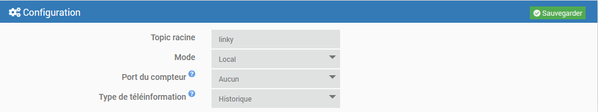

# mqttLinky plugin

## Description

Plugin allowing the retrieval of Linky teleinformation (Historical or Standard mode) in Jeedom.

This plugin does not make statistics or other graphs, it only retrieves the data.

## Prerequisites

- This plugin requires [MQTT Manager](https://market.jeedom.com/index.php?v=d&p=market_display&id=4213), an official and free plugin.

## Installation

- Download the plugin from the market
- Activate the plugin

# Configuration

## Configuration parameters :

- **Root Topic**: Root topic that Jeedom should listen to.
- **Mode** : Remote or Local. See below.
- **Counter port**: In local mode only. Serial port where the meter is connected.
- **Type of remote information**: Historical or Standard. Information visible on the meter.

### Remote & Local modes :

- **Remote Mode**: The counter is connected to another server running [mqtt4teleinfo](https://www.npmjs.com/package/mqtt4teleinfo). The latter must be configured to connect to the mqtt broker used by **MQTT Manager**.
- **Local Mode**: The nodeJS daemon runs on Jeedom, the counter is connected to the Jeedom server.

# Equipment

The equipment can be accessed from the menu Plugins → Energy.

Equipment is created when discovered by the daemon.

## Equipment configuration

By clicking on an equipment, you will find its information:

- **Equipment name**: Name of your equipment retrieved from RING.
- **Parent object**: indicates the parent object to which the equipment belongs.
- **Category**: Allows you to choose the category of the equipment.
- **Activate**: allows you to make your equipment active.
- **Visible**: makes your equipment visible on the dashboard.

Below you will find the specific information about your equipment:

- **Meter ID**: The serial number of the meter
- **Type of remote information** : The type of remote information configured (or recognised in remote mode)

### The commands

For each piece of equipment, you can create the commands you need.

The commands displayed are those corresponding to the meter's remote information type. These commands are grouped by family (General, Three-phase, Producer, etc...) in the drop-down list.

