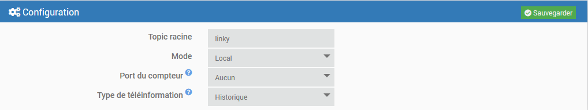
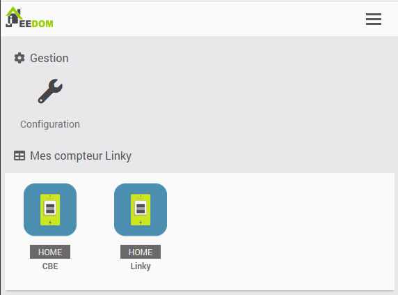
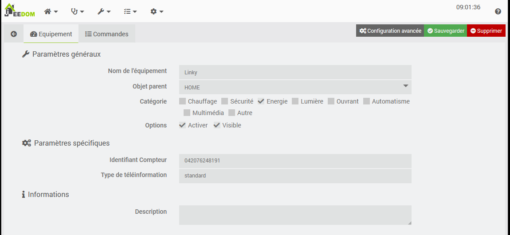
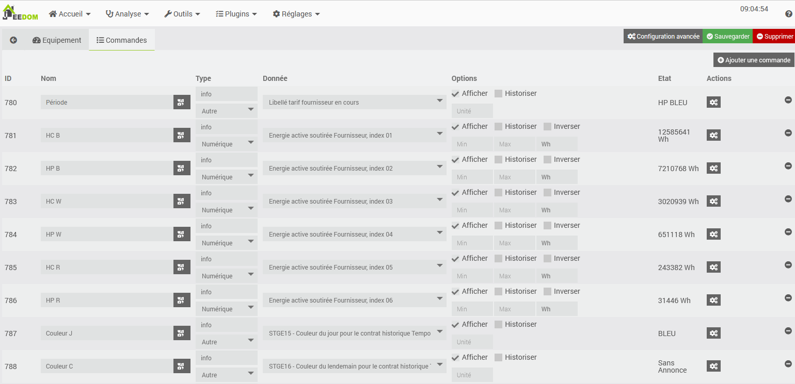
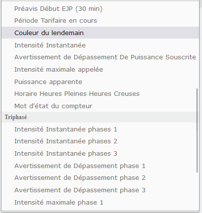

# Plugin mqttLinky - BETA

## Description

Plugin permettant la récupération de la téléinformation Linky (mode Historique ou Standard) dans Jeedom.

Ce plugin ne fait pas de statistiques ou autres graphiques, il ne fait que récupérer les données.

## Pré-Requis

- Ce plugin requiert [MQTT Manager](https://market.jeedom.com/index.php?v=d&p=market_display&id=4213), plugin officiel et gratuit.

## Installation 

- Télécharger le plugin depuis le market
- Activer le plugin

# Configuration

## Paramètres de configuration :

- **Topic racine** : Sujet racine que Jeedom doit écouter.
- **Mode** : Distant ou Local. Voir plus bas.
- **Port du compteur** : En mode local uniquement. Port série ou est relié le compteur.
- **Type de téléinformation** : Historique ou Standard. Information visible sur le compteur.

### Les modes Distant & Local :

- **Mode Distant** : Le compteur est relié à un autre serveur qui exécute [mqtt4teleinfo](https://www.npmjs.com/package/mqtt4teleinfo). Ce dernier doit être configuré pour se connecter au broker mqtt utilisé par **MQTT Manager**
- **Mode Local** : Le démon nodeJS s'exécute sur Jeedom, le compteur est relié au serveur Jeedom.

# Equipements

Les équipements sont accessibles à partir du menu Plugins → Energie.

Les équipements sont crées lors de leur découverte par le démon.

## Configuration des équipements

En cliquant sur un équipement, vous retrouverez ses informations :

- **Nom de l’équipement** : Nom de votre équipement récupéré depuis RING.
- **Objet parent** : indique l’objet parent auquel appartient l’équipement.
- **Catégorie** : permet de chosir la catégorie de l'équipement.
- **Activer** : permet de rendre votre équipement actif.
- **Visible** : rend votre équipement visible sur le dashboard.

En dessous vous retrouvez les informations spécifiques de votre équipement :

- **Identifiant Compteur** : Le numéro de série du compteur
- **Type de téléinformation** : Le type de téléinformation configuré (ou reconnu en mode distant)

### Les commandes

Pour chaque équipements, vous pouvez créer les commandes dont vous avez besoin.

Les commandes affichées sont celles correspondant au type de téléinformation du compteur. Ces commandes sont regroupées par famille (Général, Triphasé, Producteur, etc...) dans la liste déroulante.

